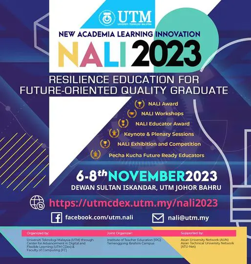
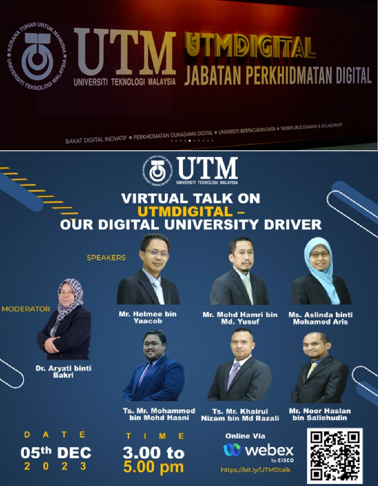
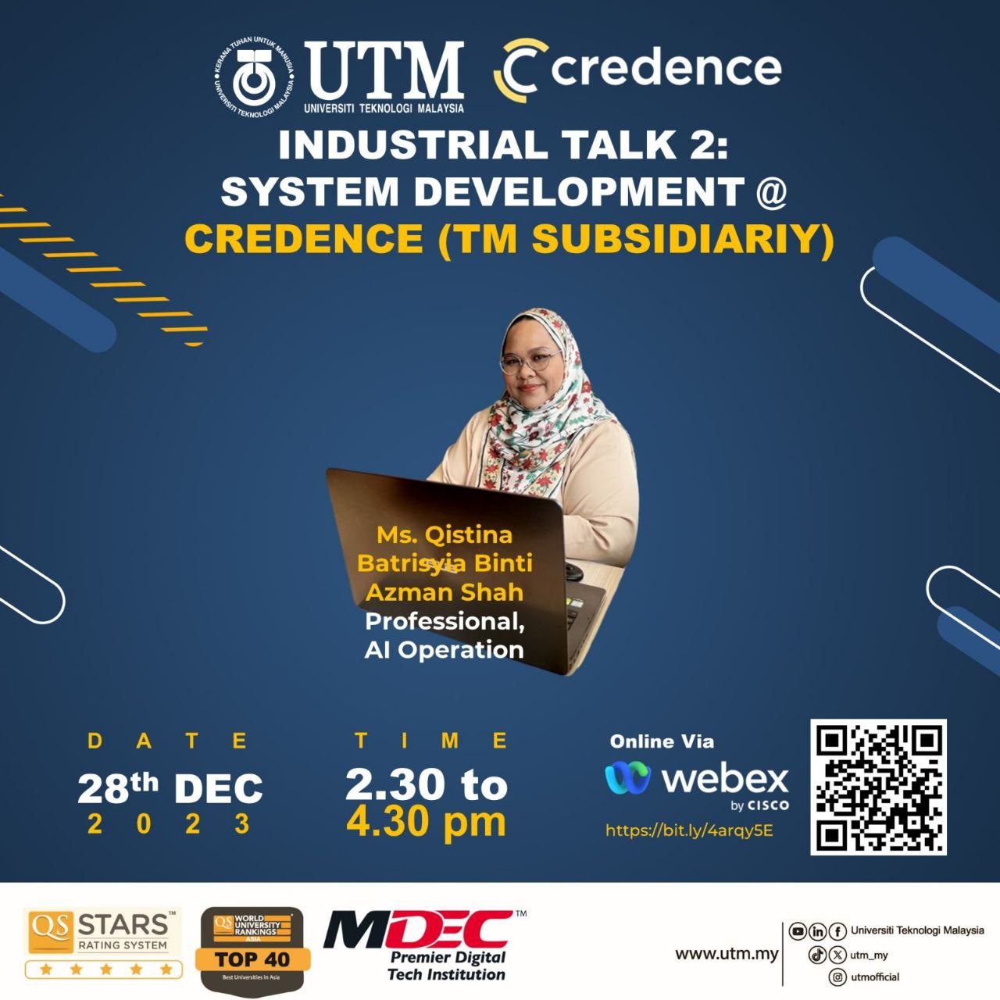
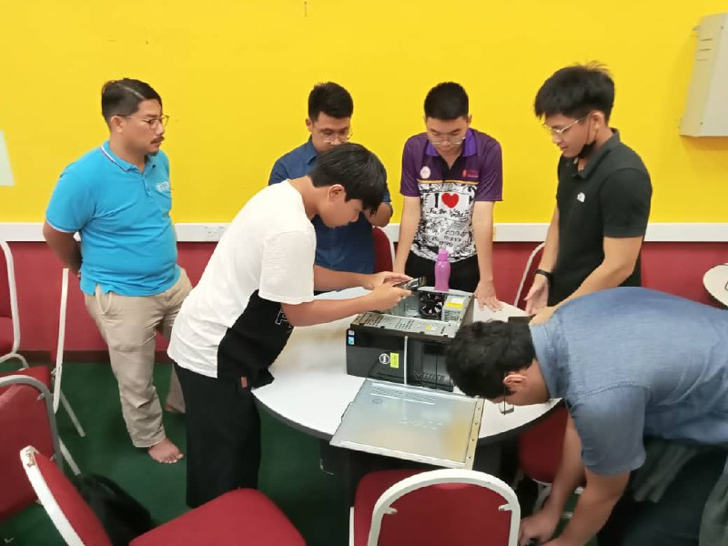

 
Hi My name is GOH CHANG ZHE(A23CS0225)
================================================================================================================================================

UTM 1st year bachelor of computer science(Software Engineering) student.
-------------------------------------------------------------------

Wish to become a decent programmer one day.

*   🌍  I'm based in Johor Bahru,Johor,Malaysia
*   🖥️  See my portfolio website at [This link](http://goh1217.github.io/)
*   ✉️  You can contact me at [changzheg@gmail.com](mailto:changzheg@gmail.com)
*   🧠  I'm learning JAVASCRIPT
*   🤝  I'm open to collaborating on any project or assignment.
*   ⚡  feel free to contact me
  ### Skills 

 

                    
### Socials
                  

                      <a href="https://discord.com/users/czczczczcz#8777" target="_blank" rel="noreferrer">
                    <picture>
                    <source media="(prefers-color-scheme: dark)" srcset="undefined" />
                    <source media="(prefers-color-scheme: light)" srcset="https://raw.githubusercontent.com/danielcranney/readme-generator/main/public/icons/socials/discord.svg" />
                    
                    </picture>
                    </a>
                      <a href="https://www.github.com/goh1217" target="_blank" rel="noreferrer">
                    <picture>
                    <source media="(prefers-color-scheme: dark)" srcset="https://raw.githubusercontent.com/danielcranney/readme-generator/main/public/icons/socials/github-dark.svg" />
                    <source media="(prefers-color-scheme: light)" srcset="https://raw.githubusercontent.com/danielcranney/readme-generator/main/public/icons/socials/github.svg" />
                    
                    </picture>
                    </a>
                      <a href="http://www.instagram.com/changzhe1217" target="_blank" rel="noreferrer">
                    <picture>
                    <source media="(prefers-color-scheme: dark)" srcset="undefined" />
                    <source media="(prefers-color-scheme: light)" srcset="https://raw.githubusercontent.com/danielcranney/readme-generator/main/public/icons/socials/instagram.svg" />
                    
                    </picture>
                    </a>
### Badges<b>Top Repositories</b>

       

                    
# Certificate & Achievement

# Assignment
 
## Reflection-ASSIGNMENT 1 NALI 2023 
  The activity NALI 2023 experience was enlightening,shows me a glimpse into the future of education through technology. Presenters from the event always show us their product that aim to foster continuous improvement and innovation in educational practices. As technology continues to evolve, integrating these advancements into education will be key to preparing students for the challenges and opportunities of the future.For example,Encourage the development of more diverse learning tools and methods to suit different type of courses and learning styles.  
  From the reflection and interview we made in that event,i learned a lot of things,including the focus on engaging students through interactive and immersive experiences is evident in several projects.For instance, the Leap Space application encourages students to explore the solar system interactively, while the E-bike tracking system addresses the practical needs of students on campus.  
  My suggestion for improving this assignment is that our team members should dare to communicate more. When there are problems, we should tell the team members immediately so that everyone can solve the problems together to prevent the problems from becoming more serious,because at that time, our team members divided the work when doing this assignment. A problem occurred and one of the team members failed to complete the work within the deadline.  
  
## Reflection-ASSIGNMENT 2 Virtual Talk 1 
  This Industrial Talk 1:overview of ICT jobs in Clarity Techwork shows us the diversity of roles within company, ranging from CTO to QA Testing Analyst to UI/UX Designer and Android App Developer.Each role contributes uniquely to the overall success of the digital asset ecosystem.From this I learned varied responsibilities and increase teamwork in the future.Besides,from the talk,i understand that continuous learning  is needed in IT industry,because rapid pace of technological advancements requires professionals to proactively seek knowledge and stay abreast of the latest trends.  
  From the poster we made about virtual talk 1,I learned basic principles of graphic design,such as layout,color theory.Learning to make a A4 poster and understand the format of a poster that include introduction,executive summary,content of those speaker and the reflection.I learned to extract useful content from what the speaker said and then reduce the content to a more concise form.  
  My suggestion for improving this assignment is i should enhance my poster design to make the poster more attractive and appealing.For examples,i could apply colour match and a more organize layout to increase readability and ensuring a polished appearance.  
   
## Reflection-ASSIGNMENT 3 Industry visit (UTM Digital) 
  This Industry visit on UTM DIgital let me understand more about various ICT services that UTM Digital provide for clients and detail of those ICT services.Besides of that,I learned that different department in UTM Digital and their unique objective to provide great service.  
  From the video we made about Industry visit,I learned the basics of video editing skill and shot techniques for better visual experiences to viewer on our video.Besides of that,I have mastered the skill of compressing relevant information from lengthy video content into concise 5-minute videos, focusing on key highlights and essential content for optimal simplicity and engagement  
  My suggestion for improving this assignment is I should strengthen my video editing skills for visual appeal and ensure that it not only attracts viewers but also effectively conveys valuable information.  
   
## Reflection-ASSIGNMENT 4 Virtual Talk 2 
  From this industry talk, I learned and understood what data analysis is, the various careers in data analysis and various tools and techniques used in system development.Apart from this, I learned that a good work culture or environment requires proper and open communication.If I were to be a systems developer in four years, I would make sure I was constantly learning and trying to keep myself busy to keep improving to make sure myself able to gain a firm foothold in this industry.  
  My suggestion for improving this assignment is that I could master the technique of extracting useful content from what the speaker said and then simplify the content into a more concise form to make the report more engaging and informative.  
    
  ## Reflection on PC Assemble 
  From this activity,our group able to assemble and reassemble PC with our own hand with lecturer's instruction and our teamwork.Its a good learning opportunity for us because it involves understanding various components such as the motherboard, CPU, RAM, GPU, storage, power supply, and cooling systems. This hands-on experience deepens your understanding of how these parts function together.Further more,those knowledge is nessecary for us to enhancing troubleshooting skills, understanding system architecture, and fostering customization abilities. It also promotes cost-effective resource allocation because PC provide cost effective manner comparing to laptop.  
  ## Reflection on Design thinking 
  My goal from learning this course is to try my best to learn about technology and information systems within this limited time, and then effectively use this knowledge to improve your own level and career. Compared with other subjects, this subject focuses more on completing assignments and communicating with team members, and these abilities will be of great help to our careers in the future.  
From this project, I learned how to use the Internet to conduct surveys, understand user needs, and how to track progress and complete projects in a planned way. This knowledge will lay a solid foundation for my career and bring me closer to my goals.  
In order to maximize my potential, I will be more active in learning various IT knowledge, participating in various projects, observing the needs of people around me, and creating the best projects to solve people's needs.  
My suggestion for improving this project is our group should create a higher quality prototype to increase feasibility.Besides of that,we can conduct various survey through more channel or platform,for example visiting users in person to understand needs.

  
  
